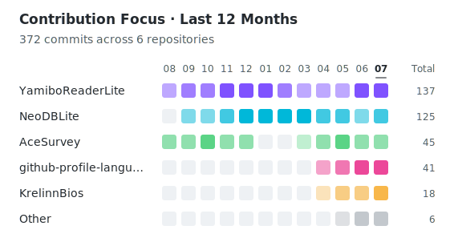

# GitHub Profile Contribution Focus

<p align="center">
  <strong>儲存庫 × 月份 · 貢獻重心 · 自動更新</strong><br>
  為 GitHub 個人主頁產生簡潔的過去一年貢獻重心圖
</p>

<p align="center">
  <a href="https://github.com/KrelinnBios/github-profile-contribution-focus/releases"></a>
  
  
</p>

<p align="center">
  <a href="README.md">简体中文</a> ·
  <a href="README.zh-TW.md">繁體中文</a> ·
  <a href="README.en.md">English</a>
</p>

## 專案簡介

GitHub Profile Contribution Focus 是一個可重複使用的 GitHub Action。它讀取 GitHub 個人主頁「過去一年」的可見貢獻，依儲存庫和月份產生 SVG 時間帶，呈現這一年主要參與了哪些專案，以及貢獻重心如何變化。

圖表只顯示貢獻量最高的 5 個儲存庫，其餘儲存庫和無法安全歸屬到特定儲存庫的貢獻逐月彙總為 `Other`。產生結果保存在自己的個人主頁儲存庫中，不依賴外部圖片服務。

## 功能概覽

- 過去一年時間帶：直接採用 GitHub 個人主頁的預設統計範圍，通常跨越 13 個自然月。
- 儲存庫貢獻列：每列對應一個參與過的可見儲存庫，每個色塊表示該儲存庫當月的全部貢獻量。
- 相對強度：使用 4 個強度等級區分活躍程度，空月份顯示為主題色軌道。
- 貢獻重心：依過去一年總貢獻量顯示前 5 個儲存庫，其餘內容逐月彙總為 `Other`。
- 貢獻總數：右側顯示每個儲存庫在統計期間內的貢獻總數。
- 主題適配：同一份 SVG 自動響應 GitHub 的淺色與深色模式。
- 快取處理：使用內容摘要產生版本化檔名，並自動清理舊圖。

## 效果預覽

<p align="center">
  
</p>

## 使用方式

### 1. 在個人主頁 README 中加入佔位圖片

```html
<p align="left">
  
</p>
```

第一次執行後，Action 會把佔位路徑替換為類似 `contribution-focus-a1b2c3d4e5f6.svg` 的版本化檔名，避免 GitHub 圖片快取。

### 2. 新增設定檔

將 [`examples/contribution-focus.config.json`](./examples/contribution-focus.config.json) 複製到個人主頁儲存庫根目錄。

在與使用者名稱同名的公開個人主頁儲存庫中，最小設定可以是空物件：

```json
{}
```

也可以明確指定帳號並覆寫儲存庫顏色：

```json
{
  "owner": "YOUR_GITHUB_USERNAME",
  "excluded_repositories": [],
  "colors": {
    "YOUR_GITHUB_USERNAME/your-repository": "#7F52FF",
    "Other": "#8B949E"
  }
}
```

### 3. 新增更新工作流程

將 [`examples/update-contribution-focus.yml`](./examples/update-contribution-focus.yml) 複製到個人主頁儲存庫的 `.github/workflows/update-contribution-focus.yml`。

核心步驟如下，執行時會自動解析並簽出最新正式版本：

```yaml
- name: Resolve latest contribution focus release
  id: contribution-focus-release
  env:
    GH_TOKEN: ${{ secrets.GITHUB_TOKEN }}
  run: |
    release_tag=$(gh api repos/KrelinnBios/github-profile-contribution-focus/releases/latest --jq .tag_name)
    echo tag=$release_tag >> $GITHUB_OUTPUT

- name: Check out contribution focus action
  uses: actions/checkout@v4
  with:
    repository: KrelinnBios/github-profile-contribution-focus
    ref: ${{ steps.contribution-focus-release.outputs.tag }}
    path: .github/actions/github-profile-contribution-focus

- name: Generate contribution focus chart
  id: contribution-focus
  uses: ./.github/actions/github-profile-contribution-focus
  with:
    github-token: ${{ secrets.GITHUB_TOKEN }}
    config-path: contribution-focus.config.json
```

範例工作流程每天自動更新一次，也支援手動執行，無需設定跨儲存庫 Token。

## 統計口徑

- 資料來自 GitHub GraphQL API 的 `contributionsCollection`。
- 總數以 GitHub 貢獻日曆為準；可由 GraphQL 歸屬儲存庫的 Commit、Issue、Pull Request、Review 和儲存庫建立貢獻會分別計入對應儲存庫。
- 統計所有參與過且權杖可見的儲存庫，不限制儲存庫是否屬於本人。
- 統計範圍直接採用 GitHub `contributionsCollection` 的預設起止時間，與個人主頁「過去一年」的口徑保持一致；首尾月份通常是不完整月份。
- 每個月份單獨查詢，Commit 依每日節點累加，其他類型使用連線總數，避免因逐項分頁遺漏月份資料。
- Discussion 或不可見私有貢獻等無法安全取得儲存庫歸屬的數量會進入 `Other`，不會洩露私有儲存庫名稱。
- 排名依過去一年的總貢獻量計算，`Other` 則逐月彙總未進入前 5 名或無法歸屬的貢獻。

## 設定說明

| 欄位 | 預設值 | 說明 |
| --- | --- | --- |
| `owner` | 目前儲存庫擁有者 | 需要統計的 GitHub 使用者名稱 |
| `excluded_repositories` | `[]` | 不參與統計的儲存庫，可寫 `owner/repo` 或儲存庫名稱 |
| `colors` | 穩定自動配色 | 以儲存庫全名、儲存庫名稱或 `Other` 覆寫列顏色 |
| `theme` | GitHub 淺色/深色配色 | 覆寫文字和空色塊顏色 |

建議使用完整的 `owner/repo` 作為顏色鍵，避免不同擁有者下的同名儲存庫發生衝突。

可覆寫的主題欄位：`light_text`、`light_muted`、`light_empty`、`dark_text`、`dark_muted`、`dark_empty`。

## Action 輸入與輸出

### 輸入

| 名稱 | 必填 | 預設值 | 用途 |
| --- | --- | --- | --- |
| `github-token` | 是 | 無 | 查詢 GitHub 可見貢獻資料 |
| `config-path` | 否 | `contribution-focus.config.json` | 設定檔路徑 |
| `readme-path` | 否 | `README.md` | 需要更新圖片引用的 README |
| `output-directory` | 否 | `.` | SVG 輸出目錄 |
| `output-prefix` | 否 | `contribution-focus` | 產生檔名前綴 |

### 輸出

| 名稱 | 說明 |
| --- | --- |
| `image` | 產生的版本化 SVG 路徑 |
| `changed` | SVG、README 引用或舊檔案是否發生變化 |

## 版本選擇與安全

- 最新正式版：建議使用上方工作流程，透過 Releases API 自動解析並簽出最新正式版本。
- 完整版本標籤：可從 [Releases](https://github.com/KrelinnBios/github-profile-contribution-focus/releases) 選擇並固定，升級時由使用者決定。
- 固定提交 SHA：可獲得最嚴格的供應鏈可重複性，但需要手動追蹤更新。

個人主頁工作流程中的 `contents: write` 用於提交產生的 SVG 和 README；Action 本身不會向其他儲存庫寫入內容。

## 本機開發

專案只使用 Python 標準函式庫：

```bash
python -m unittest discover -s tests -v
python examples/generate_preview.py
```

## 授權協議

本專案依據 [MIT License](./LICENSE) 發布，允許使用、修改、散布與商業使用，但須保留授權條款與版權聲明。

## 回饋與貢獻

歡迎透過 [GitHub Issue](https://github.com/KrelinnBios/github-profile-contribution-focus/issues) 提交使用問題、統計口徑疑問、功能建議或其他改進建議。
